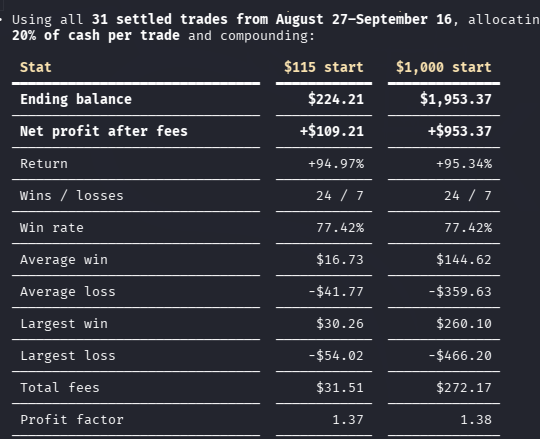

# Kalshi BTC Fresh Research

## Disclaimer and Purpose

**Not financial advice.** This project, its code, models, data, and results are
provided for educational and research purposes only. Trading involves risk,
including the loss of all money committed to a trade. Past performance,
backtests, and paper results do not guarantee future results. You are responsible
for your own trading decisions.

**Strategies do not work forever.** Market conditions change, and a strategy or
model that performed well historically can lose its edge. The historical Kalshi
15-minute BTC market data is included so you can retrain and re-evaluate models
as needed, test new ideas, and develop your own strategies. Retraining alone
does not guarantee that an edge will return. Evaluate changes on unseen data
and in paper mode before considering real-money use.

The included historical Kalshi dataset contains **6,336 markets**, with
**6,330 training rows**, covering market end times from **June 15 through
August 20, 2026 (UTC)**—about 67 days. See [the data guide](data/README.md) and
[dataset audit](data/kalshi_btc15_t600_audit.json) for details. Later bot trade
logs are separate from this historical market dataset.


## Install and Start in Paper Mode

This bot monitors Kalshi BTC 15-minute markets. Paper mode simulates trades
locally using market quotes. It uses the production Kalshi API for data;
it does not place real orders. This is separate from Kalshi's demo environment.

### 1. Get a Kalshi account and API key

Create an account at [Kalshi](https://kalshi.com/) and complete the account setup.
In **Account & security → API Keys**, choose **Create Key**. Save the API Key ID
and download the private key file before leaving the page; the private key
cannot be retrieved later. See
[Kalshi's official API setup guide](https://docs.kalshi.com/getting_started/quick_start_authenticated_requests).

Use credentials from your production account for these commands. This version
reads your account balance and positions even in paper mode, so credentials are
required. The simulated starting balance is set separately below.

### 2. Download and install

Install Git and Python 3.11 or newer first. Open a terminal and run the commands
for your operating system. Cloning downloads the code and included research data.

**Linux / macOS / Windows WSL:**

```sh
git clone https://github.com/J0shusmc/Kalshi-BTC.git
cd Kalshi-BTC
python3 -m venv venv
source venv/bin/activate
python -m pip install --upgrade pip
python -m pip install -r requirements.txt
cp .env.example .env
```

**Windows PowerShell:**

```powershell
git clone https://github.com/J0shusmc/Kalshi-BTC.git
cd Kalshi-BTC
py -3 -m venv venv
.\venv\Scripts\Activate.ps1
python -m pip install --upgrade pip
python -m pip install -r requirements.txt
Copy-Item .env.example .env
```

If PowerShell blocks activation, use `.\venv\Scripts\python.exe` in place of
`python` for the install and launch commands. On Debian/Ubuntu, a missing `venv`
module can be installed with `sudo apt install python3-venv`.

### 3. Add your credentials locally

Move the downloaded private key into the `Kalshi-BTC` folder and rename it
`kalshi_private.key`. Open `.env` in a text editor and replace the placeholder:

```dotenv
KALSHI_API_KEY=your-api-key-id
KALSHI_PRIVATE_KEY_PATH=kalshi_private.key
```

The folder should contain `.env`, `kalshi_private.key`, `README.md`, and
`scripts/`. The API key field takes the **Key ID**; the second field takes the
**file path**, not the private key's text. An absolute path to a private key
stored elsewhere also works. On Windows, use forward slashes in that path.
On Linux/macOS, restrict local access with `chmod 600 .env kalshi_private.key`.

Keep `.env` and the private key on your own computer. Both are ignored by Git;
do not paste their contents into agent chats, issues, or commits.

### 4. Run paper mode

From the repository root, with the virtual environment active:

```sh
python scripts/btc15_live_monitor.py --paper --risk-pct 20 --starting-balance-cents 11500 --trade-log local/paper_trade_log.json --json-out local/paper_latest.json
```

This starts with **$115 of simulated equity** and sizes signals at 20%, rounded
up to whole contracts. For **$1,000**, use `--starting-balance-cents 100000` and
separate paths such as `local/paper_1000_trade_log.json` and
`local/paper_1000_latest.json`. Reusing a log resumes its saved paper history;
choose a new log filename to start a fresh simulation.

Confirm the terminal says **PAPER**. `WAITING` signals are normal: the bot waits
for its entry conditions. Keep the terminal running; press **Ctrl+C** to stop.
The `local/` directory is created automatically and ignored by Git. To restart,
open the project folder, activate `venv`, and run the same command.
Use `--paper` for this setup; `--live` enables real orders.

For a single startup check, append `--once --no-color` to the command. A
successful check shows the current market in PAPER mode without an authentication
error; a rollover message alone means you should retry after the next market opens.
For authentication errors, check the Key ID, private key path, and that the key
belongs to the production account. Paper fills are simulated and can differ from
actual execution.

### Set it up with a coding agent (Codex preferred)

Open the downloaded repository in Codex or your preferred coding agent and paste:

```text
Set up https://github.com/J0shusmc/Kalshi-BTC on this computer in PAPER MODE ONLY.
Follow its README and inspect the current script before running commands.
Clone the repo if needed, create a Python virtual environment, and install
requirements.txt. Copy .env.example to .env only if .env does not already exist.
Help me create a Kalshi account and API key using the official guide, then tell
me where to enter my Key ID and save my private key locally. Never print or ask
me to paste credentials into chat, and never commit them.
Use $115 simulated starting equity, 20% sizing, local/paper_trade_log.json,
and local/paper_latest.json. Preserve existing logs; ask before resetting them.
Run a --paper --once --no-color startup check and resolve setup errors.
Then launch the continuous paper monitor in a terminal and verify PAPER mode.
Never use --live, place real orders, or modify my existing live bot processes.
Show me how to stop and restart it and where my paper results are saved.
```

## Hypothetical Cash Replay



Replay of 31 settled trades from August 27 through September 16, 2026, allocating
20% of cash per trade and compounding. Assumes identical fill prices,
proportionally scaled fees, and cash available before the next trade; ignores
settlement delays, deposits, and withdrawals. Contracts are rounded up to whole
numbers. These are hypothetical results, not actual account returns.
Maximum closed-trade drawdown was 53.33% for the $115 start and 52.86% for the
$1,000 start.

## Research Background

This repo has been reset away from the copied BTC15 market-midpoint correction
pipeline.

The retained data is included for reproducible strategy research. The next approach should look for
our own edge instead of calibrating Kalshi's midpoint and calling that a model.

## Current Read

The old method was not useless, but it was too thin:

- Kalshi midpoint was already strongly predictive versus 50/50.
- The best model mostly recalibrated the market midpoint.
- The lockbox improvement over midpoint was tiny.
- Kalshi-only microstructure features did not show a robust independent edge.

## Fresh Direction

Add external BTC price features at the same cutoff:

- Spot return into `t-600`.
- Futures basis if available.
- Short-term volatility.
- Candle wick/body features.
- Trend into `t-600`.
- Distance from the 15-minute open.

If those fail to beat market midpoint out of fold, this path is likely not worth
more time.

## Kept

- `data/kalshi_btc15_t600_training.parquet`
- `data/kalshi_btc15_t600_audit.json`
- `data/synthetic_demo.parquet`
- `data/README.md`
- `data/raw/kalshi_btc15/`: historical market metadata and candlesticks,
  including per-ticker candle files used by the research scripts.
- `data/external/btc_usd_1m_coinbase.parquet`: external BTC minute candles.
- `reports/`: saved research results, predictions, trade logs, and summaries.

## Running Research

From the repository root:

```sh
python3 -m venv venv
source venv/bin/activate
pip install -r requirements.txt
python scripts/btc15_first5_outcome_research.py
python scripts/btc15_directional_dip_research.py
```

These commands use the included historical files and write results to `reports/`.
The first command regenerates the predictions consumed by the second.
Historical research does not require `.env` or Kalshi credentials.

## Publishing

The ignore rules include the historical data and reports while excluding `.env`
files, private keys (including backups), virtual environments, and Python caches.
Keep credentials local. Use Git to publish the project so these exclusions apply;
uploading the entire folder or a manually created archive does not apply
`.gitignore` automatically.
