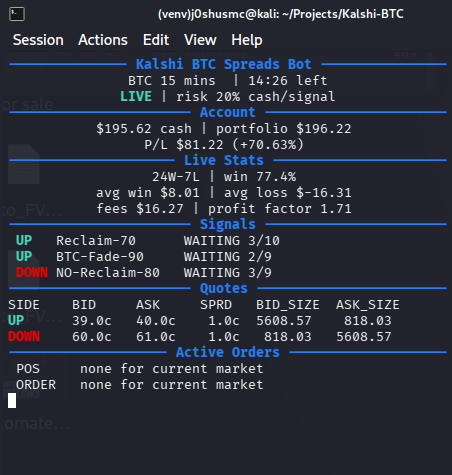

# Kalshi BTC Fresh Research



This repo has been reset away from the copied BTC15 market-midpoint correction
pipeline.

The retained data is included for reproducible strategy research. The next approach should look for
our own edge instead of calibrating Kalshi's midpoint and calling that a model.

## Current Read

The old method was not useless, but it was too thin:

- Kalshi midpoint was already strongly predictive versus 50/50.
- The best model mostly recalibrated the market midpoint.
- The lockbox improvement over midpoint was tiny.
- Kalshi-only microstructure features did not show a robust independent edge.

## Fresh Direction

Add external BTC price features at the same cutoff:

- Spot return into `t-600`.
- Futures basis if available.
- Short-term volatility.
- Candle wick/body features.
- Trend into `t-600`.
- Distance from the 15-minute open.

If those fail to beat market midpoint out of fold, this path is likely not worth
more time.

## Kept

- `data/kalshi_btc15_t600_training.parquet`
- `data/kalshi_btc15_t600_audit.json`
- `data/synthetic_demo.parquet`
- `data/README.md`
- `data/raw/kalshi_btc15/`: historical market metadata and candlesticks,
  including per-ticker candle files used by the research scripts.
- `data/external/btc_usd_1m_coinbase.parquet`: external BTC minute candles.
- `reports/`: saved research results, predictions, trade logs, and summaries.

## Running Research

From the repository root:

```sh
python3 -m venv venv
source venv/bin/activate
pip install -r requirements.txt
python scripts/btc15_first5_outcome_research.py
python scripts/btc15_directional_dip_research.py
```

These commands use the included historical files and write results to `reports/`.
The first command regenerates the predictions consumed by the second.
Historical research does not require `.env` or Kalshi credentials.

## Publishing

The ignore rules include the historical data and reports while excluding `.env`
files, private keys (including backups), virtual environments, and Python caches.
Keep credentials local. Use Git to publish the project so these exclusions apply;
uploading the entire folder or a manually created archive does not apply
`.gitignore` automatically.
